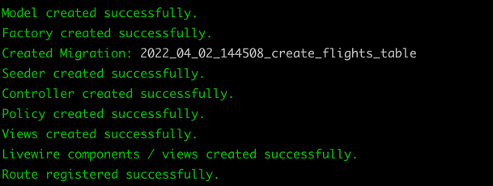

# Livewire CRUD

## Introduction

Livewire crud is a beautiful command for generating CRUD. It will create model, factory, migration, seeder, controller,
policy, view blade files, livewire components / views and route register on web.php 🚀

Livewire crud is designed using [Tailwind CSS](https://tailwindcss.com)
, [Livewire](https://jetstream.laravel.com/2.x/stacks/livewire.html)
in laravel application.

## Installation

Require this package with composer using the following command:

````
composer require poojajadav/livewire-crud
````

## Usage
To get started, let's create CRUD from scratch:

````
php artisan livewire:crud Flight
````
It'll generate model, factory, migration, seeder, controller,
policy, view blade files, livewire components / views and route register on web.php. 


## Publish vendor

If you need to overwrite the stubs, then you can publish them using the vendor:publish Artisan command:

````
php artisan livewire-crud:stubs
````
